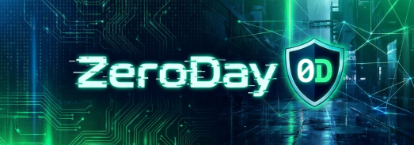

<div align="center">
  
  
  # ZeroDay Security Bot
  
  **Your proactive guardian against CVEs and security threats on Discord.**
  
  [](https://opensource.org/licenses/MIT)
  [](https://discord.js.org/)
  [](https://nodejs.org/)
</div>

---

**ZeroDay** is an advanced open-source Discord bot designed to monitor security feeds (including CVEs and major security news) in real-time. It analyzes vulnerability reports and automatically alerts users who have subscribed to specific keywords (e.g., "Windows", "RCE", "PHP"), ensuring your team stays ahead of threats.


## Prerequisites

- Node.js
- MySQL Server (local or remote)
- A Discord Bot created on the [Discord Developer Portal](https://discord.com/developers/applications)

## Installation

1.  Install dependencies:
    ```bash
    npm install
    ```

2.  Configure environment:
    - Rename or copy `.env` file and fill in the details:
      - `DISCORD_TOKEN`: Your bot token.
      - `CLIENT_ID`: Application ID (Client ID).
      - `DB_...`: Your MySQL credentials.

3.  Deploy commands (run once or after changing commands):
    ```bash
    npm run deploy
    ```

4.  Start the bot:
    ```bash
    npm start
    ```

## Usage

- `/setup [channel]`: Sets the channel where the bot will post alerts. (Admin only)
- `/keywords add [keyword]`: Adds a keyword to your watchlist.
- `/keywords remove [keyword]`: Removes a keyword.
- `/keywords list`: Lists your keywords.
- `/help`: Displays help information.

## How it works

The bot periodically checks (every 5 minutes) a security RSS feed. If a new article contains one of your keywords (e.g., "injection", "windows", "php"), you will be pinged in the alert channel.
